# What is it?

This is a simple project for understanding lighting in computer graphics.

## How to use?

## Step 1
- navigate to cloned repo
- git clone https://github.com/microsoft/vcpkg.git

## Step 2 - Windows
- .\vcpkg\bootstrap-vcpkg.bat
- .\vcpkg\vcpkg install glm:x64-windows
- .\vcpkg\vcpkg install sdl2:x64-windows

## Step 2 - Linux
- ./vcpkg/bootstrap-vcpkg.bat
- ./vcpkg/vcpkg install glm:x64-linux
- ./vcpkg/vcpkg install sdl2:x64-linux

## Step 3
- mkdir build
- cd build
- cmake -DCMAKE_TOOLCHAIN_FILE="./vcpkg/scripts/buildsystems/vcpkg.cmake" .. 

## Gallery

| test1_gradient.ppm  |
| ------------- 	  |
|     |

| test2_background.ppm  |
| ------------- 	  |
|     |

| test3_sphere.ppm  |
| ------------- 	  |
| 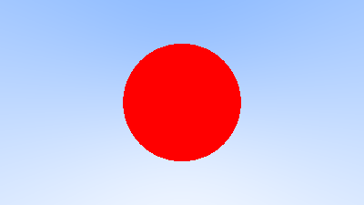    |

| test4_world_sphere.ppm  |
| ------------- 	  |
| 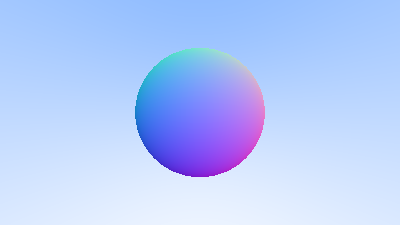    |

| test5_world_sphere_with_ground.ppm  |
| ------------- 	  |
| 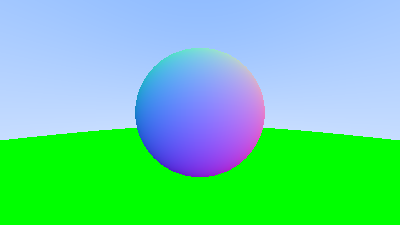    |

| test6_world_camera.ppm  |
| ------------- 	  |
| 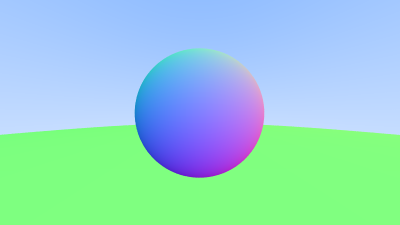    |

| test6_world_camera.ppm (anti-aliasing)	 | (without it) 	|
| ------------- 	  | ------------- 		 	|
| 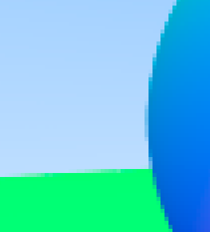|	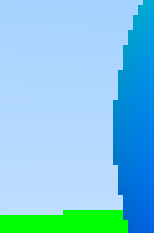 |

| test7_world_camera_aa_diffuse_gamma_correction.ppm (without lambert) | with lambert |
| ------------- 	  | ------------- 		 	|
| 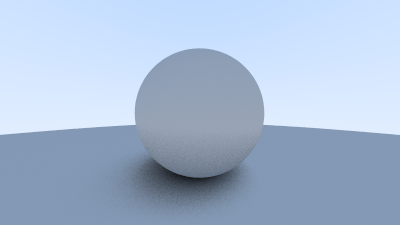    | 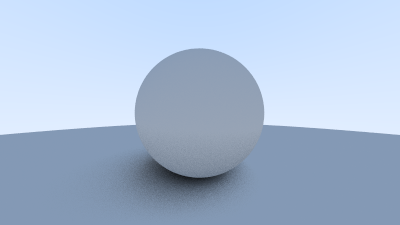 |

| test8_world_camera_materials_with_gamma_correction.ppm | metal | many objects (diffuse and metal) | many objects (metal fuzz effect) |
| ------------- | ------------- | ------------- | ------------- |
| 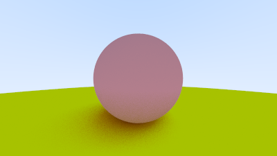    | 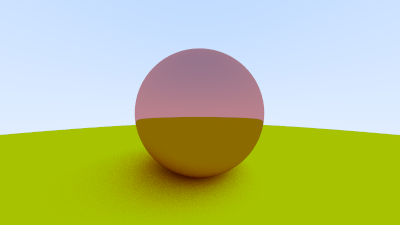 | 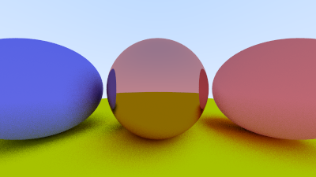 | 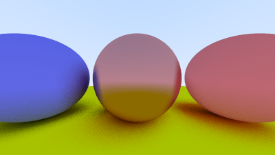 |